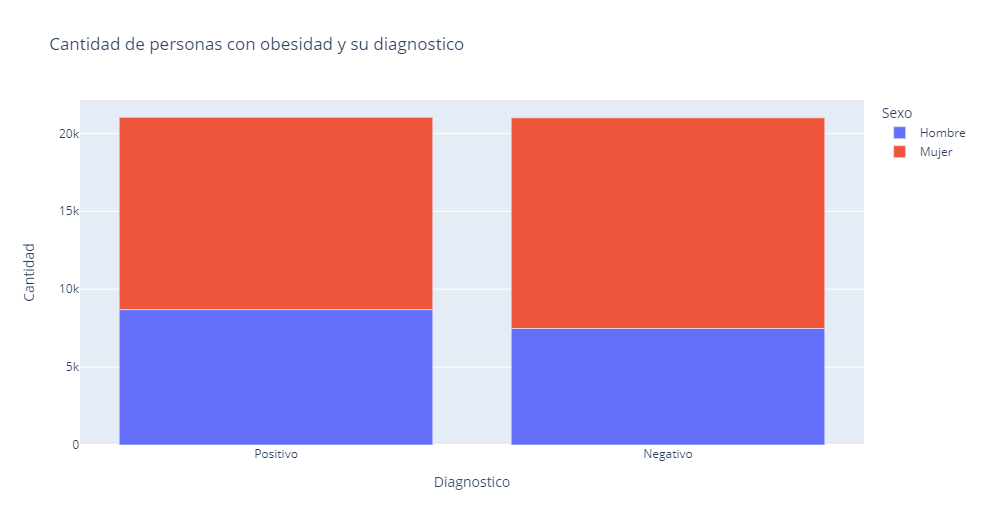

# Herramientas de productividad
## Cursos propedéuticos para la maestría en ciencia de datos- Universidad de Sonora

**Introducción:**
Una de las primeras cosas que un cientifico de datos deberia hacer antes de hacer un clasificador o predictor, es analizar la correlacion de los datos, y eso es lo que quiero dejar listo con mi limpieza de datos, haciendo enfoque en las comorbilidades de las personas cuyas muestras fueron tomadas. 

**Datos utilizados:**
[COVID-19](https://www.gob.mx/salud/documentos/datos-abiertos-bases-historicas-direccion-general-de-epidemiologia)

**Herramientas**
Docker, csvcut, csvkit, wget, curl, zip

Pasos:
1. Clonar el repositorio
~~~
    git clone https://github.com/jjups96/curso-hpcd.git
~~~

2. Creamos una carpeta que se llame temp
~~~
    docker build -t mcd-hpcd .
    docker run -it -v $PWD/temp:/tunnel --name covid19 mcd-hpcd
~~~

3. Generamos la imagen de un dockerfile
~~~
    docker build -t mcd-hpcd .
~~~

4. Contruimos un contenedor con un volumen definido
~~~
    docker run -it -v $PWD/temp:/tunnel --name covid19 mcd-hpcd
~~~

### **Resultados:** 
#### Al correr construir el contenedor no es necesario siquiera tocar la terminal, puesto que el documento se mueve la carpeta que creada durante la instalacion

### **Ejemplo:** 
#### Se realizo una exploracion rapida con el fin de mostrar como pude ser usado el resultado. En la imagen podemos apreciar que las porporciones son bastantes similares tanto en el genero como en el diagnostico

### **Trabajo futuro:** 
#### Mezclar la informacion de las comorbilidades para analizar su impacto en el diagnostico
